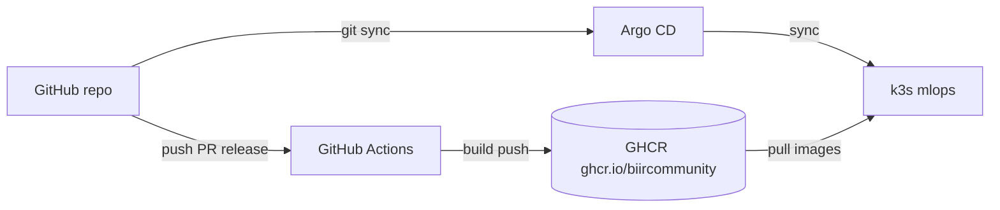
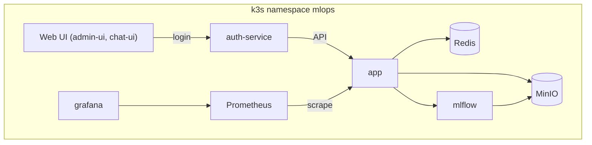

# mlops-core

Платформа MLOps для LLM: inference (TTT), LoRA post-train, единый пайплайн моделей (MLflow → disk → DVC → inference), мониторинг drift/toxicity, Admin UI и Chat UI с централизованной авторизацией.

**Основной деплой:** k3s + Argo CD, образы из GHCR, публичный доступ через Traefik Ingress (`https://adaptive-llm.ru`).  
**Docker Compose** — только для локальной разработки.

## Архитектура

### CI/CD и GitOps



### k3s namespace mlops



## Доступ к сервисам

Основной способ — **HTTPS на одном домене** (параметр `ingress.domain` в Argo CD → `mlops-core-secrets`):

| URL | Сервис |
|-----|--------|
| `https://adaptive-llm.ru/admin` | Admin UI — LoRA training, deploy, users |
| `https://adaptive-llm.ru/chat` | Chat UI — веб-чат, рейтинги |
| `https://adaptive-llm.ru/v1/docs` | Swagger UI (OpenAPI) |
| `https://adaptive-llm.ru/v1/training/*` | Training / admin API |
| `https://adaptive-llm.ru/v1/chat/completions` | Inference + TTT |
| `https://adaptive-llm.ru/v1/auth/*` | Auth-service (login, users, API keys) |
| `https://adaptive-llm.ru/grafana` | Grafana — LLM / drift дашборды |
| `https://adaptive-llm.ru/mlflow` | MLflow tracking & registry |
| `https://adaptive-llm.ru/minio` | MinIO Console |
| `https://adaptive-llm.ru/minio-api` | MinIO S3 API (DVC, артефакты) |
| `https://adaptive-llm.ru/argocd/` | Argo CD UI |

Префикс `/api/*` **deprecated** — редирект на `/v1/docs`.

### NodePort (LAN / отладка)

Если Ingress недоступен, сервисы проброшены на NodePort (публичный IP по умолчанию `83.221.210.29`, LAN ноды `192.168.0.103`):

| Сервис | NodePort | Пример |
|--------|----------|--------|
| admin-ui | 30000 | `http://83.221.210.29:30000` |
| chat-ui | 30100 | `http://83.221.210.29:30100` |
| grafana | 30300 | `http://83.221.210.29:30300` |
| mlflow | 30500 | `http://83.221.210.29:30500` |
| app (API) | 30800 | `http://83.221.210.29:30800/v1/docs` |
| minio API | 30900 | `http://83.221.210.29:30900` |
| minio console | 30901 | `http://83.221.210.29:30901` |

На роутере пробросить порты `30000`, `30100`, `30300`, `30500`, `30800`, `30900`, `30901`, `80`, `443` → LAN IP ноды.

## API

Все публичные HTTP-маршруты — под **`/v1`** (см. Swagger: `/v1/docs`).

| Группа | Prefix | Примеры |
|--------|--------|---------|
| Auth | `/v1/auth`, `/v1/users`, `/v1/api-keys` | `POST /v1/auth/login` |
| Inference | `/v1` | `POST /v1/chat/completions`, `POST /v1/feedback` |
| Training | `/v1/training` | `GET /v1/training/jobs`, `POST /v1/training/models/deploy` |
| Monitoring | `/`, `/v1/drift` | `GET /health`, `GET /metrics`, `GET /v1/drift/reports` |

Inference (`/v1/chat/completions`, `/v1/feedback`) требует **`INFERENCE_API_KEY`** — заголовок `X-API-Key` или `Authorization: Bearer`.

Training и admin endpoints — JWT после `POST /v1/auth/login`.

## Учётные записи и секреты

Пароли задаются в Argo CD → Application **`mlops-core-secrets`** → Helm → Parameters (не в Git):

| UI / сервис | Логин | Пароль / ключ |
|-------------|-------|----------------|
| Admin / Chat | `admin` | `secrets.authBootstrapPassword` |
| Grafana | `secrets.grafanaAdminUser` | `secrets.grafanaAdminPassword` |
| MinIO | `secrets.minioAccessKey` | `secrets.minioSecretKey` |
| Inference API | — | `secrets.inferenceApiKey` → `INFERENCE_API_KEY` |
| MLflow | — | без авторизации |

Полный список параметров: `deploy/helm/mlops-secrets/values.yaml`.

## Быстрый старт (k3s + Argo CD)

### Требования

- [k3s](https://k3s.io/) + `kubectl`, StorageClass `local-path`
- [Argo CD](https://argo-cd.readthedocs.io/) в кластере
- NVIDIA GPU + device plugin (без GPU → `deploy/argocd/application-no-gpu.yaml`)
- Образы в GHCR (`ghcr.io/biircommunity/mlops-core-*`)

### Деплой

```bash
# Argo CD (если ещё не установлен)
kubectl create namespace argocd
kubectl apply -n argocd --server-side -f \
  https://raw.githubusercontent.com/argoproj/argo-cd/stable/manifests/install.yaml

# Applications
kubectl apply -f deploy/argocd/application-secrets.yaml
kubectl apply -f deploy/argocd/application.yaml          # GPU
# kubectl apply -f deploy/argocd/application-no-gpu.yaml # CPU

# В UI: mlops-core-secrets → Helm Parameters (домен, пароли) → Sync
#       mlops-core → Sync
# TLS: kubectl -n mlops create secret tls adaptive-llm-tls --cert=... --key=...

./scripts/k3s-copy-model.sh   # model.pt → PVC
```

Подробная инструкция: [docs/deploy-argocd.md](docs/deploy-argocd.md) (Ingress, TLS, webhook, Release, Rollback).

## CI / CD

| Workflow | Триггер | Назначение |
|----------|---------|------------|
| **CI** (`.github/workflows/ci.yml`) | PR в `main` | black, pylint, сборка и push образов в GHCR (тег = имя ветки) |
| **Release** (`.github/workflows/release.yml`) | manual | Сборка по tag → approval `production` → patch/sync Argo CD `mlops-core` |
| **Rollback** (`.github/workflows/rollback.yml`) | manual | Откат на уже опубликованный tag в GHCR без пересборки |

Секрет GitHub Actions: `ARGOCD_AUTH_TOKEN`. Environment **`production`** — required reviewers перед деплоем.

Теги образов в Argo CD UI: Application → Edit → Kustomize → Images (полный путь `ghcr.io/biircommunity/mlops-core-app:1.0.11`).

## Пайплайн моделей

1. **Deploy** — Admin UI или `POST /v1/training/models/deploy` → артефакт из MLflow на диск, `active_model.json`
2. **DVC** — `models/model.pt` синхронизируется в MinIO
3. **Restart** — `kubectl -n mlops rollout restart deployment/app`

```bash
cp .dvc/config.local.example .dvc/config.local
./scripts/dvc-setup.sh
dvc pull
```

## Мониторинг и drift

- **Prometheus** scrape `/metrics` с `app`
- **Grafana** — дашборд **LLM Drift** (`uid: llm-drift`): data / concept / target drift
- Drift считается онлайн на каждом `POST /v1/chat/completions` (embedding + PSI)
- Baseline: **200** запросов (`DRIFT_BASELINE_SIZE`), rolling window: **100** (`DRIFT_WINDOW_SIZE`)
- Отчёты: `GET /v1/drift/reports`, Admin UI → drift alerts

Для появления метрик в Grafana отправьте chat-запросы (Chat UI или API с `INFERENCE_API_KEY`). Сильный drift — при резкой смене языка/длины промптов; для демо достаточно мягкого смещения (например, другой город в том же формате промпта).

## Локальная разработка

```bash
uv sync --group dev
uv run pytest
uv run black app tests auth-service
uv run pylint app
uv run pylint auth-service/auth_service
```

Admin UI / Chat UI:

```bash
cd admin-ui && npm ci && npm run dev   # VITE_API_BASE_URL=/v1/training
cd chat-ui && npm ci && npm run dev
```

### Docker Compose (legacy)

```bash
cp .env.docker.compose.example .env.docker.compose
docker compose --env-file .env.docker.compose -f deploy/compose/docker-compose.yml up -d
```

См. [deploy/compose/README.md](deploy/compose/README.md).

## Cookiecutter

Каркас для новых MLOps-проектов (не копия mlops-core):

```bash
uv run cookiecutter cookiecutter/
```

Подробнее: [cookiecutter/README.md](cookiecutter/README.md).

## Структура репозитория

```
├── app/                         # LLM inference, training API, drift, OpenAPI
├── auth-service/                # FastAPI + SQLite: users, API keys
├── admin-ui/                    # React Admin Studio
├── chat-ui/                     # React Chat UI
├── k8s/
│   ├── base/                    # Deployments, Services, Grafana dashboards
│   ├── components/ghcr-images/  # Kustomize image names
│   └── overlays/no-gpu/         # CPU overlay
├── deploy/
│   ├── argocd/                  # Argo CD Applications, server subpath
│   ├── helm/mlops-secrets/      # секреты, Ingress, Traefik middlewares
│   └── compose/                 # Docker Compose для dev
├── scripts/
│   ├── k3s-copy-model.sh        # model.pt → PVC
│   └── dvc-setup.sh
├── docs/deploy-argocd.md        # полная документация деплоя
└── models/model.pt.dvc          # модель в MinIO через DVC
```

## Документация

- [docs/deploy-argocd.md](docs/deploy-argocd.md) — деплой, Ingress, TLS, Release, Rollback, webhook
