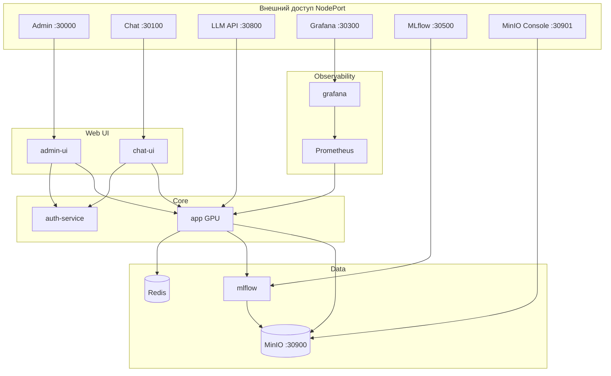

# mlops-core

Платформа MLOps для LLM: inference (TTT), LoRA post-train, единый пайплайн моделей (MLflow → disk → DVC → inference), мониторинг drift/toxicity, Admin UI и Chat UI с централизованной авторизацией.

**Основной деплой: k3s + Argo CD** (образы из GHCR). Docker Compose — только для локальной разработки.

## Архитектура



## Сервисы и порты (k3s)

Публичный IP задаётся переменной `MLOPS_PUBLIC_URL` (по умолчанию `http://83.221.210.29`).

| Сервис | Назначение | NodePort | Пример URL |
|--------|------------|----------|------------|
| **admin-ui** | LoRA training, deploy, users | 30000 | `http://83.221.210.29:30000` |
| **chat-ui** | Веб-чат, рейтинги | 30100 | `http://83.221.210.29:30100` |
| **app** | Inference + training API | 30800 | `http://83.221.210.29:30800/docs` |
| **grafana** | Дашборды LLM / drift | 30300 | `http://83.221.210.29:30300` |
| **mlflow** | Tracking, registry | 30500 | `http://83.221.210.29:30500` |
| **minio console** | Web UI S3 | 30901 | `http://83.221.210.29:30901` |
| **minio api** | S3 API (DVC, артефакты) | 30900 | `http://83.221.210.29:30900` |
| auth-service | JWT, users, API keys | — | только внутри кластера |
| redis, prometheus | TTT-сессии, scrape | — | только внутри кластера |

**Traefik (порт 80):** `http://83.221.210.29/admin`, `/chat`, `/api`, `/grafana`, `/mlflow`

### Учётные записи

| UI | Логин | Пароль |
|----|-------|--------|
| Admin / Chat | `admin` | `AUTH_BOOTSTRAP_PASSWORD` (Argo CD → mlops-core-secrets) |
| Grafana | `admin` | `GF_SECURITY_ADMIN_PASSWORD` (Argo CD → mlops-core-secrets) |
| MinIO | `MINIO_ACCESS_KEY` | `MINIO_SECRET_KEY` (Argo CD → mlops-core-secrets) |
| MLflow | — | без авторизации |

## Быстрый старт (k3s + Argo CD)

### Требования

- [k3s](https://k3s.io/) + `kubectl`, StorageClass `local-path`
- [Argo CD](https://argo-cd.readthedocs.io/) в кластере
- NVIDIA GPU + device plugin (без GPU → `deploy/argocd/application-no-gpu.yaml`)
- Образы в GHCR (CI на PR / Release workflow)

### Деплой

```bash
kubectl apply -f deploy/argocd/application-secrets.yaml
kubectl apply -f deploy/argocd/application.yaml
# CPU: application-no-gpu.yaml вместо application.yaml
./scripts/k3s-copy-model.sh
```

Подробнее: [docs/deploy-argocd.md](docs/deploy-argocd.md).

На роутере → `192.168.0.103` (LAN IP ноды):

`30000`, `30100`, `30300`, `30500`, `30800`, `30900`, `30901`, `80`

## Пайплайн моделей

1. **Deploy** — Admin UI или `POST /training/deploy` → артефакт из MLflow на диск, `active_model.json`
2. **DVC** — `models/model.pt` синхронизируется в MinIO
3. **Restart** — `kubectl -n mlops rollout restart deployment/app`

```bash
cp .dvc/config.local.example .dvc/config.local
./scripts/dvc-setup.sh
dvc pull
```

## Локальная разработка

```bash
uv sync --group dev
uv run pytest
uv run black app tests auth-service
uv run pylint app
uv run pylint auth-service/auth_service
```

### Docker Compose (legacy)

```bash
cp .env.docker.compose.example .env.docker.compose
docker compose --env-file .env.docker.compose -f deploy/compose/docker-compose.yml up -d
```

## Cookiecutter

Каркас для новых MLOps-проектов (не копия mlops-core):

```bash
uv run cookiecutter cookiecutter/
```

Подробнее: [cookiecutter/README.md](cookiecutter/README.md).

## Структура репозитория

```
├── app/                      # LLM inference, training API, drift
├── auth-service/             # FastAPI + SQLite: users, API keys
├── admin-ui/                 # React Admin Studio
├── chat-ui/                  # React Chat UI
├── k8s/
│   ├── base/
│   ├── components/ghcr-images/
│   └── overlays/no-gpu/
├── deploy/
│   ├── argocd/               # Argo CD Applications
│   ├── helm/mlops-secrets/   # секреты (Helm, правки в UI)
│   └── compose/              # Docker Compose для dev
├── scripts/
│   ├── k3s-copy-model.sh     # model.pt → PVC
│   └── dvc-setup.sh
├── docs/deploy-argocd.md
└── models/model.pt.dvc       # модель в MinIO через DVC
```

## CI / CD

- **CI** (`.github/workflows/ci.yml`): lint, build, push образов в `ghcr.io/biircommunity/mlops-core-*`
- **CD**: Argo CD — теги и секреты в UI, см. [docs/deploy-argocd.md](docs/deploy-argocd.md)


Deploy: [docs/deploy-argocd.md](docs/deploy-argocd.md)
