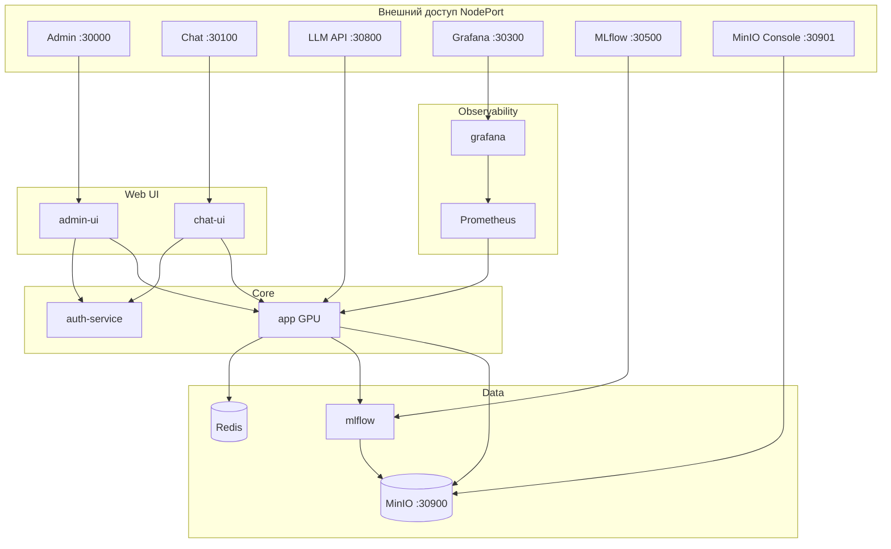

# {{ cookiecutter.project_slug }}

Платформа MLOps для LLM: inference (TTT), LoRA post-train, единый пайплайн моделей (MLflow → disk → DVC → inference), мониторинг drift/toxicity, Admin UI и Chat UI с централизованной авторизацией.

**Основной деплой: k3s** (локальный registry + NodePort). Docker Compose — только для локальной разработки.

## Архитектура



## Сервисы и порты (k3s)

Публичный IP задаётся переменной `MLOPS_PUBLIC_URL` (по умолчанию `{{ cookiecutter.mlops_public_url }}`).

| Сервис | Назначение | NodePort | Пример URL |
|--------|------------|----------|------------|
| **admin-ui** | LoRA training, deploy, users | 30000 | `{{ cookiecutter.mlops_public_url }}:30000` |
| **chat-ui** | Веб-чат, рейтинги | 30100 | `{{ cookiecutter.mlops_public_url }}:30100` |
| **app** | Inference + training API | 30800 | `{{ cookiecutter.mlops_public_url }}:30800/docs` |
| **grafana** | Дашборды LLM / drift | 30300 | `{{ cookiecutter.mlops_public_url }}:30300` |
| **mlflow** | Tracking, registry | 30500 | `{{ cookiecutter.mlops_public_url }}:30500` |
| **minio console** | Web UI S3 | 30901 | `{{ cookiecutter.mlops_public_url }}:30901` |
| **minio api** | S3 API (DVC, артефакты) | 30900 | `{{ cookiecutter.mlops_public_url }}:30900` |
| auth-service | JWT, users, API keys | — | только внутри кластера |
| redis, prometheus | TTT-сессии, scrape | — | только внутри кластера |

**Traefik (порт 80):** `{{ cookiecutter.mlops_public_url }}/admin`, `/chat`, `/api`, `/grafana`, `/mlflow`

### Учётные записи

| UI | Логин | Пароль |
|----|-------|--------|
| Admin / Chat | `admin` | `AUTH_BOOTSTRAP_PASSWORD` из `k8s/secrets.yaml` |
| Grafana | `admin` | `GF_SECURITY_ADMIN_PASSWORD` из secrets |
| MinIO | `MINIO_ACCESS_KEY` | `MINIO_SECRET_KEY` из secrets |
| MLflow | — | без авторизации |

## Быстрый старт (k3s)

### Требования

- [k3s](https://k3s.io/) + `kubectl`, StorageClass `local-path`
- NVIDIA GPU + device plugin + `runtimeClassName: nvidia` (без GPU → `k8s/overlays/no-gpu`)
- Docker (сборка образов)
- **Не запускать microk8s и k3s одновременно** — конфликт портов 10248/10250

### 1. Секреты

```bash
cp k8s/secrets.example.yaml k8s/secrets.yaml
# HF_TOKEN, AUTH_BOOTSTRAP_PASSWORD, MINIO_*, GF_SECURITY_ADMIN_*
```

### 2. Registry (один раз)

```bash
./scripts/k3s-setup-registry.sh
sudo cp deploy/k3s/registries.yaml /etc/rancher/k3s/registries.yaml
sudo systemctl restart k3s
# Docker: добавить deploy/k3s/daemon.json.snippet в /etc/docker/daemon.json
sudo systemctl restart docker
```

Подробнее: [deploy/k3s/README.md](deploy/k3s/README.md).

### 3. Сборка и деплой

```bash
# опционально: другой публичный IP
export MLOPS_PUBLIC_URL={{ cookiecutter.mlops_public_url }}

./scripts/k3s-build-images.sh   # docker build + push → {{ cookiecutter.mlops_registry }}
./scripts/k3s-deploy.sh
./scripts/k3s-copy-model.sh     # model.pt → PVC (первый раз)
```

Загрузка GPU-модели ~2–3 мин; readiness probe у `app` — до 3 мин.

### 4. Проброс портов (доступ из интернета)

На роутере → `{{ cookiecutter.lan_ip }}` (LAN IP ноды):

`30000`, `30100`, `30300`, `30500`, `30800`, `30900`, `30901`, `80`

## Пайплайн моделей

1. **Deploy** — Admin UI или `POST /training/deploy` → артефакт из MLflow на диск, `active_model.json`
2. **DVC** — `models/model.pt` синхронизируется в MinIO
3. **Restart** — `kubectl -n {{ cookiecutter.namespace }} rollout restart deployment/app`

```bash
cp .dvc/config.local.example .dvc/config.local
./scripts/dvc-setup.sh
dvc pull
```

## Локальная разработка

```bash
uv sync --group dev
uv run pytest
uv run black app tests
uv run pylint app
```

### Docker Compose (legacy)

```bash
cp .env.docker.compose.example .env.docker.compose
docker compose --env-file .env.docker.compose -f deploy/compose/docker-compose.yml up -d
```

## Cookiecutter

Полный production-шаблон стека (app, auth, UI, k8s, скрипты):

```bash
uv sync --group dev
uv run cookiecutter cookiecutter/
```

См. [cookiecutter/README.md](cookiecutter/README.md). После изменений в репозитории: `uv run python scripts/sync_cookiecutter_template.py`.

## Структура репозитория

```
├── app/                      # LLM inference, training API, drift
├── auth-service/             # FastAPI + SQLite: users, API keys
├── admin-ui/                 # React Admin Studio
├── chat-ui/                  # React Chat UI
├── k8s/
│   ├── base/                 # Deployment, PVC, NodePort, Ingress
│   └── overlays/no-gpu/      # CPU-only overlay
├── deploy/
│   ├── k3s/                  # registries.yaml, daemon.json
│   └── compose/              # Docker Compose для dev
├── cookiecutter/             # Шаблон нового проекта
├── scripts/
│   ├── k3s-setup-registry.sh
│   ├── k3s-build-images.sh
│   ├── k3s-deploy.sh
│   └── k3s-copy-model.sh
├── docs/deploy-k3s.md
└── models/model.pt.dvc       # модель в MinIO через DVC
```

## Скрипты k3s

| Скрипт | Назначение |
|--------|------------|
| `k3s-setup-registry.sh` | Локальный registry `:5000` |
| `k3s-build-images.sh` | Build + push всех образов |
| `k3s-deploy.sh` | secrets + `kubectl apply -k k8s/` |
| `k3s-copy-model.sh` | Копирование `model.pt` в PVC |

Переменные: `MLOPS_PUBLIC_URL`, `MLOPS_REGISTRY`, `MLOPS_IMAGE_TAG`.

## CI

GitHub Actions (`.github/workflows/ci.yml`): black, pylint, build app-образа, `kubectl kustomize k8s/`.

## Troubleshooting

| Симптом | Решение |
|---------|---------|
| `ErrImageNeverPull` / `ImagePullBackOff` | `./scripts/k3s-build-images.sh`, проверить registry |
| `app` CrashLoop: `model.pt not found` | `./scripts/k3s-copy-model.sh` |
| `Found no NVIDIA driver` | `runtimeClassName: nvidia` в `k8s/base/app.yaml`, device plugin |
| UI 502 на `/api/*` | Пересобрать admin-ui/chat-ui (nginx без Docker DNS) |
| k3s не стартует после restart | `sudo snap stop microk8s`, убить stale shims, `systemctl start k3s` |
| Снаружи не открывается | Использовать IP сервера, не `localhost`; проброс портов на роутере |

Документация: [docs/deploy-k3s.md](docs/deploy-k3s.md) · [k8s/README.md](k8s/README.md)
